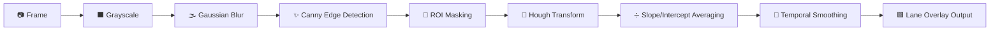

<div align="center">


<a href="https://github.com/your-username/lane-detection">
  
</a>

<br/>


</div>

---


</div>

---

## 🚦 Overview

This project implements a **computer-vision pipeline** that detects and highlights
road lane lines in both **images and video streams** — a foundational perception
module used in **Advanced Driver Assistance Systems (ADAS)** and autonomous
vehicle navigation stacks.



---

## ✨ Features

| | Feature |
|---|---|
| 🖼️ | Detects lanes in **static images** |
| 🎬 | Processes **video files frame-by-frame** |
| 📊 | Generates a **pipeline-stages figure** for reports/presentations |
| 🌊 | **Temporal smoothing** for jitter-free video output |
| 🟢 | Shaded **drivable-corridor** overlay between lanes |
| ⚡ | Lightweight — only `OpenCV` + `NumPy`, real-time capable |

---

## 📂 Project Structure

```
lane_detection/
├── lane_detection.py     # Core CV pipeline (importable module)
├── main.py                # CLI — image / video / debug modes
├── generate_test_data.py  # Synthetic road image + video generator
├── requirements.txt
├── images/                # Input images
├── videos/                # Input videos
└── output/                # Annotated results
```

---

## 🛠️ Installation

```bash
git clone https://github.com/your-username/lane-detection.git
cd lane-detection

python3 -m venv venv
source venv/bin/activate   # Windows: venv\Scripts\activate

pip install -r requirements.txt
```

---

## ▶️ Usage

### Generate sample test data
```bash
python3 generate_test_data.py
```

### Detect lanes in an image
```bash
python3 main.py --mode image --input images/sample_road.jpg --output output/result.jpg
```

### Detect lanes in a video
```bash
python3 main.py --mode video --input videos/sample_road.mp4 --output output/result.mp4
```

### Generate a pipeline-stages figure
```bash
python3 main.py --mode debug --input images/sample_road.jpg --output output/pipeline_stages.jpg
```

---

## 🧩 Use as a Library

```python
import cv2
from lane_detection import process_frame, LaneSmoother

frame = cv2.imread("images/sample_road.jpg")
annotated = process_frame(frame)
cv2.imwrite("output/result.jpg", annotated)

# For video — reuse a smoother across frames for stability
smoother = LaneSmoother(buffer_size=8)
for frame in video_frames:
    annotated = process_frame(frame, smoother=smoother)
```

---

## 🎛️ Tuning Guide

| Parameter | Location | Effect |
|---|---|---|
| `low_threshold` / `high_threshold` | `detect_edges()` | Canny sensitivity |
| ROI `vertices` | `region_of_interest()` | Search trapezoid shape — match your camera FOV |
| `threshold`, `minLineLength`, `maxLineGap` | `hough_transform()` | Line segment detection strictness |
| `abs(slope) < 0.3` | `average_slope_intercept()` | Filters near-horizontal false positives |
| `buffer_size` | `LaneSmoother` | Smoothness vs. responsiveness on curves |

---

## 🗺️ Roadmap

- [ ] Perspective (bird's-eye) transform + polynomial curve fitting
- [ ] HSV/HLS color thresholding for yellow lane markings
- [ ] Deep-learning segmentation (LaneNet / SCNN)
- [ ] Kalman-filter based lane tracking
- [ ] Sensor fusion with LiDAR/radar


## 📄 License

This project is licensed under the **MIT License**.

---

<div align="center">


## 👨‍💻 Developer

<div align="center">


### Akash

**Engineering Student • Data Science Enthusiast • Builder**


</div>

<br/>


<div align="center">
⭐ **If this project helped you, consider giving it a star!** ⭐

</div>
